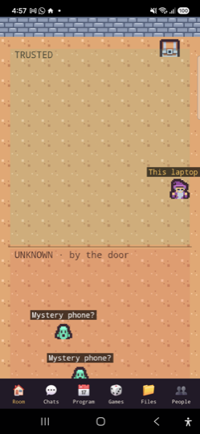
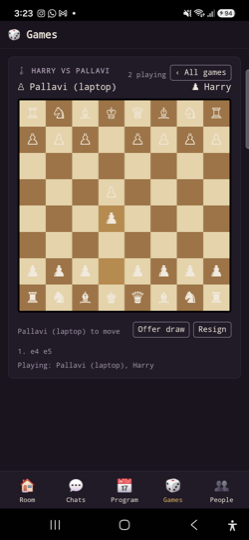
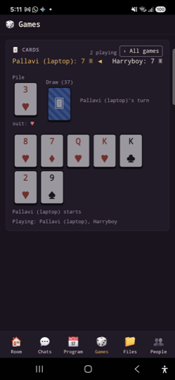
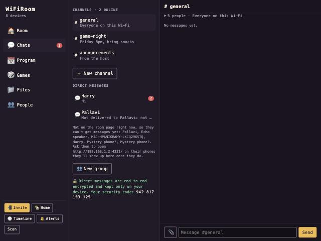

# WiFiRoom 🏠

**A private intranet for one Wi-Fi.** Chat, share files, play games, run a program and go live with a video or your screen, for everyone in the room: a game night, a hostel floor, a classroom, an event, a resort, a flight. No internet, no accounts, no cloud. One command on a laptop, or the phone app.

```bash
npx wifiroom --share
```

Everyone else on the Wi-Fi opens the address it prints (or scans the QR), picks a name, and they're in. Nothing leaves the network.

<p align="center">
  
  
  
  
</p>
<p align="center"></p>

## What's in the room

Five areas, as a sidebar on laptops and a tab bar on phones:

- **🏠 Room.** Everyone on the Wi-Fi as a character in a tiny pixel room. Unknown devices walk in as ghosts; name them or trust them and they become people. Tap the floor to walk, poke a device to ping it, send a reaction or a link straight to someone's screen.
- **💬 Chats.** Channels kept on the device hosting the room (`#general` for everyone, `#announcements` for the host, public channels, private rooms), so late arrivals see the history. Direct messages and small groups are end-to-end encrypted and never stored on the host. 📎 sends files device to device; 📞 is a voice call.
- **📅 Program.** What's happening: a schedule with *now* and *next*, polls, and sign-up sheets. Anyone can add; the host runs the show.
- **🎲 Games.** ♟️ Chess, 🎲 Ludo (2–4), 🃏 Crazy Eights (2–6), 🂡 Texas Hold'em (2–8, chips, side pots, showdown), a 🔔 buzzer quiz, and 🤔 "Most likely to…", with a scoreboard for the night. Hidden hands stay hidden: each player gets their own view from the host.
- **📁 Files.** Nothing is uploaded anywhere. You *allow a folder* on your own device; people see the listing and ask for a file, which is sent to them encrypted from your device. Stop sharing and it's gone for everyone. **📺 Live:** play a video or a song from your device, or share your laptop screen, and everyone who presses Watch gets it streamed straight from you, in sync.
- **👥 People.** Who's here, with message / call / ring buttons, and the host's tools: lock the room, remove someone, clean up.

## How it works

- **One device hosts.** `npx wifiroom --share` on a laptop, or the phone app. The host keeps the channels, program, games and scoreboard in `~/.wifiroom/` (on the phone, in the app's own storage). Everyone else is a browser tab.
- **One room per Wi-Fi.** A shared room announces itself and answers `/room.json`; `npx wifiroom` and the app look for one first and join it instead of starting a second. `--host` forces a new one. The phone app hands an empty room of its own over to a laptop's room when one appears.
- **Device to device where it matters.** Calls, files from shares, and live video go straight between the two devices (WebRTC); the room only passes along the sealed connection setup. When a router keeps two devices apart (some split the 2.4 and 5 GHz bands), file transfers fall back to passing through the room, encrypted.
- **No build step.** Plain HTML/JS served by the host: Phaser for the room, Preact for the panes, tweetnacl for encryption, Socket.IO for the room's own messages.

## Safe with strangers on the Wi-Fi

Public Wi-Fi means strangers. The design assumes it:

- **A name belongs to a key.** Your identity is a key pair your browser keeps; your name is tied to it and unique in the room. Everyone shows a fingerprint (`Harry · #a11c`) derived from the key, which can't be chosen or copied. Same name, different code: different person.
- **Linking a device moves the key, sealed.** The new device shows a 12-character code (60 bits, single use, 2 minutes); the old device seals its key under that code and leaves the blob with the room, which can't read it. Nobody without the code can claim an identity.
- **Private chats are end-to-end encrypted** (tweetnacl box). The host only ever sees ciphertext, and nothing is stored on it. Security codes let two people check nobody swapped keys.
- **Nothing is uploaded to the host.** Files come from the owner's device, only to the person who asked, only while the owner allows it. Files are shared as-is; nothing checks them, and the page says so.
- **The host can lock the room** (nobody new) and **remove a person** (their key is barred until let back). Games are ended by the people in them, not the host. The host can clean up: end games, clear scores, the program, channels, or forget everyone.
- **Nothing leaves the network.** No accounts, no cloud, no analytics, no STUN/TURN servers.

## Usage

```bash
npx wifiroom              # join the room on this Wi-Fi, or open one just for you
npx wifiroom --share      # open a room everyone on this Wi-Fi can join
npx wifiroom --code       # …and require a 6-digit code to get in
npx wifiroom --host       # open your own room even if one is already open
npx wifiroom --port 5000  # use another port
npx wifiroom --help
```

Requires [Node.js](https://nodejs.org) 20 or newer. Without `--share` only your own computer can open the room; with it, anyone on the Wi-Fi can join by address or QR, but device controls, addresses and the API stay on your computer. Use `--share` on networks you trust, or `--code` and the host tools above on ones you don't. Calls need the room open at `localhost` or in the app (browsers allow the microphone only on secure pages); `npx wifiroom` opens a joined room through localhost for exactly that reason.

**The phone app** (Android) hosts a room on the phone itself with the same server, joins a laptop's room when there is one, shares folders with the system folder picker, and makes calls. It lives in its own repository.

## Chat, files and calls, in detail

- **Messages** in channels are kept on the host; direct messages and groups are end-to-end encrypted in the browser (tweetnacl), and the host only passes along scrambled text. Compare security codes with someone to be sure nobody swapped keys.
- **📎 Files** in a chat (up to 200 MB each) go straight from your device to theirs over WebRTC. If the two devices can't reach each other, the file comes through the room instead, still encrypted with a key only the chat members have. Nothing is stored; a received file stays until you close the page, so save it.
- **📞 Voice calls** connect each pair of people directly. Browsers only allow the microphone on secure pages, so calls work in the app and on laptops (both open the room through `localhost`), but not from a phone's browser opening `http://192.168…`. Those people can still chat and send files.

## Control your devices

WiFiRoom detects what each device announces on your Wi-Fi and shows only the controls it supports. You don't need to set up your TV brand.

| Device announces | Usually | What you can do |
|---|---|---|
| Google Cast | Google TV / Android TV (Sony, TCL, Mi, OnePlus, Hisense, Philips…), Chromecast, Nest speakers | Play YouTube links and video/music URLs, pause/resume/stop, volume |
| DLNA media renderer | Most smart TVs and many speakers | Play video/music URLs, pause/resume/stop, volume |
| A real hardware address | PCs, NAS boxes, some TVs | **Wake** it with Wake-on-LAN, even after it's gone offline |
| A phone that joined the room | Any phone with the page open | **🔔 Ring** it: loud beeps, vibration and a flashing screen |

| Google Cast, DLNA or AirPlay TV | Smart TVs, Chromecast | **📺 Share my screen** (see below) |
| A smart-home protocol (see below) | Plugs, bulbs, cameras | On/off, brightness, color, snapshot |

YouTube on Cast devices uses YouTube's unofficial remote interface, which could stop working if YouTube changes it. DLNA can't play YouTube links, only direct media URLs.

## Share your screen to the TV

Click a TV in the room and press **📺 Share my screen**. WiFiRoom captures your screen with **ffmpeg** and asks the TV to play it.

- **You need ffmpeg installed** (it isn't bundled): `brew install ffmpeg` on macOS, `winget install ffmpeg` on Windows, `sudo apt install ffmpeg` on Linux. WiFiRoom looks for it on your `PATH` and in `/opt/homebrew/bin`.
- **Google Cast TVs** get a live HLS stream; **DLNA TVs** get a live MPEG-TS stream.
- **It runs a few seconds behind** (typically 3–8 s, depending on the TV). Fine for showing photos, slides or a web page; not for games or typing along. Video only, no sound.
- **How the TV reaches your computer:** while you share, WiFiRoom opens a second, tiny web server on your computer's Wi-Fi address (on a random port) that serves only the stream files, under a random, unguessable path that changes every time. It closes when you stop sharing. Your main WiFiRoom page stays limited to this computer unless you used `--share`. Anyone on your Wi-Fi who learned that link could watch while you share, so use it on networks you trust.
- **macOS:** the first time, macOS asks for **Screen Recording** permission for the app you started WiFiRoom from (Terminal, iTerm, Claude…). Allow it in System Settings → Privacy & Security → Screen & System Audio Recording, then restart WiFiRoom. If your firewall is on, macOS may also ask whether `node` may accept incoming connections: allow it, or the TV can't fetch the stream.
- **Linux:** needs an X11 session (Wayland isn't supported by ffmpeg's `x11grab`).
- **AirPlay TVs on macOS** *(experimental)*: macOS has no public command for screen mirroring, so WiFiRoom clicks Control Center's **Screen Mirroring** menu for you with AppleScript and picks your TV by name. It needs **Accessibility** permission (System Settings → Privacy & Security → Accessibility) and may break whenever Apple changes that menu. You can always use Control Center yourself.

## Run your home

WiFiRoom finds these on your Wi-Fi by themselves and controls them locally, with no cloud accounts. Open **🏡 Home** for the full list, or click the device's character in the room.

| Device | How | What you can do |
|---|---|---|
| TP-Link **Kasa** plugs, switches, bulbs | Local protocol | On/off, brightness, color (bulbs) |
| Philips **Hue** | Your Hue bridge | On/off, brightness, color. The first time, press the bridge's button and click **Pair** |
| **Shelly** relays, plugs, dimmers, shutters | Local HTTP API | On/off, brightness (dimmers), open/close |
| **LIFX** bulbs | Local protocol | On/off, brightness, color |
| **ONVIF** IP cameras | WS-Discovery | Snapshot. Add the camera login under 🏡 Home → ⚙️ Settings |
| **Home Assistant** (anything it supports) | Your Home Assistant | Lights, switches, **air conditioners and thermostats** (set temperature), covers, cameras |

**Home Assistant** is the catch-all for everything else (WiZ, Yeelight, Tuya, AC units…). In 🏡 Home → ⚙️ Settings, enter its address (e.g. `http://homeassistant.local:8123`) and a **long-lived access token** (Home Assistant → your profile → Security). The token is saved only on this computer, in `~/.wifiroom/home.json` (readable only by your user account), is never sent to a browser or to phones in the room, and is only used to talk to your own Home Assistant. Clear the address to disconnect.

## Use it from scripts

Run WiFiRoom in the background, then control devices by name from your terminal, a shell script or cron:

```bash
npx wifiroom serve                                  # no browser; keep it running
npx wifiroom devices                                # what's here and what each can do
npx wifiroom play "living room" https://youtu.be/dQw4w9WgXcQ
npx wifiroom volume "living room" 20
npx wifiroom screen "living room" start
npx wifiroom wake desktop                           # works even if it's offline now
npx wifiroom home "desk lamp" brightness 40
npx wifiroom poke printer || echo "printer is down"
npx wifiroom history --json
```

A device can be its nickname, part of its name, or an id from `wifiroom devices` (or `wifiroom home` for smart-home devices). Commands exit with status 1 and an error on stderr when something fails, and `--json` prints machine-readable output.

The same commands are a local HTTP API at `http://localhost:4321/api`, for any language:

| Request | Body | Does |
|---|---|---|
| `GET /api/devices` | | List devices here now, with `caps` |
| `GET /api/known` | | Devices seen before with a real hardware address (wakeable) |
| `GET /api/timeline` | | Recent arrivals and departures, newest first |
| `POST /api/scan` | | Ping the network once, then list devices |
| `POST /api/devices/<device>/play` | `{"url": "..."}` | Play a YouTube link or media URL |
| `POST /api/devices/<device>/volume` | `{"level": 20}` | Set volume 0-100 |
| `POST /api/devices/<device>/pause` · `resume` · `stop` | | Control playback |
| `POST /api/devices/<device>/screen_start` · `screen_stop` | | Share this computer's screen |
| `POST /api/devices/<device>/wake` | | Wake-on-LAN |
| `POST /api/devices/<device>/poke` | | Ping; returns `alive` and `ms` |
| `POST /api/devices/<device>/ring` | | Ring a phone that has the room open |
| `GET /api/home` | | List smart-home devices |
| `POST /api/home/<device>/<action>` | `{"value": ...}` | `turn_on`, `turn_off`, `toggle`, `set_brightness`, `set_color`, `set_temperature`, `snapshot` |

```bash
curl -X POST localhost:4321/api/devices/living%20room/volume -H 'content-type: application/json' -d '{"level": 20}'
```

The API only answers requests from this computer, even with `--share`, and refuses requests from web pages open in your browser.

## Use it from your AI (Claude, Cursor, ChatGPT)

WiFiRoom works as an [MCP](https://modelcontextprotocol.io) server, so your own AI app can use your network as tools. It runs on the AI subscription you already have, with no API keys and no extra cost.

> "What's on my Wi-Fi?" · "Is the printer online?" · "Play this video on the living room TV and set volume to 20" · "Wake my desktop" · "Ring Rahul's phone" · "Show my screen on the TV" · "Turn off the kitchen lights" · "Set the bedroom AC to 23" · "Show me the porch camera"

**Claude Desktop:** add this to your config (Settings → Developer → Edit Config):

```json
{
  "mcpServers": {
    "wifiroom": { "command": "npx", "args": ["-y", "github:hariharapanigrahy/wifiroom", "mcp"] }
  }
}
```

**Claude Code:**

```bash
claude mcp add wifiroom -- npx -y github:hariharapanigrahy/wifiroom mcp
```

**Cursor and others:** use the same command, `npx -y github:hariharapanigrahy/wifiroom mcp`.

Tools: `list_devices`, `poke_device`, `play_on_device`, `control_media`, `wake_device`, `ring_phone`, `send_link`, `say_in_room`, `who_was_home`, `screen_share`, `home_devices`, `home_control`, `camera_snapshot`. If WiFiRoom is already running, the MCP server connects to it; otherwise it starts one in the background.

## Privacy

| | |
|---|---|
| Network scanning | **None.** WiFiRoom reads your computer's existing ARP table and listens for Bonjour/mDNS announcements. To find smart-home devices it also sends the standard "who's there?" broadcasts those devices are built to answer (SSDP, Kasa, LIFX, ONVIF WS-Discovery) |
| Data leaving your network | **None** from WiFiRoom itself: no analytics, accounts or cloud. Playing a YouTube link asks your TV to load it from YouTube |
| Where your labels live | `~/.wifiroom/db.json` on your computer |
| What visitors see (with `--share`) | Names and characters only. Never IP addresses, MAC addresses, or the timeline |
| Poke | Sends one ping to the device you clicked |
| Device control | Only when you (or your AI or scripts) ask, and only to the device you picked |
| Local API | Answers only this computer, never other devices on your Wi-Fi or web pages in your browser |
| Screen sharing | Stays on your Wi-Fi: the TV fetches the stream straight from your computer, only while you share |
| Home Assistant token | Stored only in `~/.wifiroom/home.json` (file mode 600); never sent to browsers or visitors |

## Honest limits

- **Phones show up as "Mystery phone?".** Modern phones and laptops use a private (random) Wi-Fi address, so their maker is hidden. Nickname them, or ask them to join with `--share`.
- **Departures are slow.** Your computer remembers devices for up to ~20 minutes, so "left" lags behind reality.
- **Messages only reach people who joined.** Nothing is pushed to a phone that hasn't opened the room in its browser.
- **Screen sharing lags a few seconds and has no sound.** HLS and MPEG-TS are streaming formats, not live mirroring. Some DLNA TVs refuse live streams. AirPlay mirroring is experimental UI scripting.
- **Smart-home drivers were written from each project's documentation and haven't all been tried on real hardware yet.** Home Assistant control was tested against a simulated Home Assistant; screen capture and the stream server were tested on macOS without a TV. Reports are very welcome.
- **Newer Kasa firmware and Tapo devices** use an encrypted protocol that `tplink-smarthome-api` doesn't speak; add them to Home Assistant instead. Kasa power strips appear as one entry per outlet.
- **Shelly devices with a password** (and Gen1 devices that only announce themselves weakly) may not show up or respond; Home Assistant covers them.
- **WiZ and Yeelight** have no well-maintained, permissively licensed Node package, so they're supported through Home Assistant rather than directly.
- **ONVIF snapshots** use the camera login you enter; cameras that only accept Digest authentication give you a link instead of a picture.

## Platforms

| | macOS | Windows | Linux |
|---|---|---|---|
| Room, alerts, timeline, poke, sharing | ✅ tested | should work, untested | should work, untested |
| Screen capture + stream server | ✅ tested (no TV yet) | should work (gdigrab), untested | should work on X11 (x11grab), untested |
| AirPlay mirroring | experimental, untested on a TV | — | — |
| Smart-home drivers | written from docs; Home Assistant tested against a simulator | same | same |

Bug reports from Windows and Linux are very welcome.

## Built from

WiFiRoom is glue between open-source packages. Every direct dependency is MIT licensed, except the two Apache-2.0 packages listed below:

| Job | Package |
|---|---|
| Game engine | [phaser](https://github.com/phaserjs/phaser) |
| Web server and realtime room | [express](https://github.com/expressjs/express), [socket.io](https://github.com/socketio/socket.io) |
| Device names (Bonjour) | [bonjour-service](https://github.com/onlxltd/bonjour-service) |
| Device list (ARP) | [@network-utils/arp-lookup](https://github.com/justintaddei/arp-lookup) |
| Device maker | [@network-utils/vendor-lookup](https://github.com/mfucci/vendor-lookup) |
| Poke | [ping](https://github.com/danielzzz/node-ping) |
| Cast / DLNA / Wake-on-LAN | [castv2-client](https://github.com/thibauts/node-castv2-client), [node-ssdp](https://github.com/diversario/node-ssdp), [upnp-mediarenderer-client](https://github.com/thibauts/node-upnp-mediarenderer-client), [wake_on_lan](https://github.com/agnat/node_wake_on_lan) |
| YouTube on Cast | [youtube-remote](https://github.com/alxhotel/youtube-remote) |
| AI tools (MCP) | [@modelcontextprotocol/sdk](https://github.com/modelcontextprotocol/typescript-sdk), [socket.io-client](https://github.com/socketio/socket.io), [zod](https://github.com/colinhacks/zod) |
| Invite QR code | [qrcode](https://github.com/soldair/node-qrcode) |
| Storage | [lowdb](https://github.com/typicode/lowdb) |
| Open browser | [open](https://github.com/sindresorhus/open) |
| Pixel art | [Kenney Tiny Dungeon](https://kenney.nl/assets/tiny-dungeon) (CC0) |

Added for screen sharing and the smart home:

| Job | Package | License | Downloads/week* | Last release |
|---|---|---|---|---|
| Kasa plugs and bulbs | [tplink-smarthome-api](https://github.com/plasticrake/tplink-smarthome-api) | MIT | ~1.9k | 2023 (5.0.0) |
| Philips Hue | [node-hue-api](https://github.com/peter-murray/node-hue-api) | **Apache-2.0** | ~2.7k | 2023 (5.0.0-beta.16, npm's `latest` tag) |
| LIFX bulbs | [lifx-lan-client](https://github.com/node-lifx/lifx-lan-client) | MIT | ~90 | 2025 (2.1.2) |
| IP cameras (ONVIF) | [onvif](https://github.com/agsh/onvif) | MIT | ~18k | 2026 (0.8.3) |
| Home Assistant | [home-assistant-js-websocket](https://github.com/home-assistant/home-assistant-js-websocket) (official) | **Apache-2.0** | ~29k | 2026 (9.7.0) |
| WebSocket for Node 20 | [ws](https://github.com/websockets/ws) | MIT | ~330M | 2026 |
| Screen capture | **ffmpeg, not bundled.** WiFiRoom runs the copy you installed; no ffmpeg code ships with WiFiRoom | — | — | — |
| Shelly | none: Shelly's documented local HTTP API, called with `fetch` | — | — | — |

\*Weekly npm downloads, checked October 2026.

Transitive dependencies (the packages these pull in) also include other permissive licenses: ISC, BSD-2, BSD-3, Apache-2.0, BlueOak-1.0.0 and public domain. None are GPL or AGPL. Most come from Express and qrcode. See the full list with:

```bash
npx license-checker-rseidelsohn --production --summary
```

`npm audit` reports advisories in packages WiFiRoom already used before 0.3.0, none added by the new packages: `ip` (inside `node-ssdp`), and `protobufjs` (inside `castv2`, used to talk to Cast devices on your own network). None has a non-breaking fix yet.

## License

MIT
